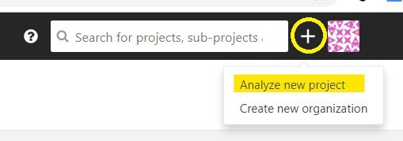
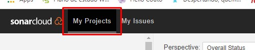
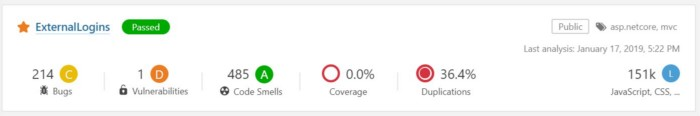
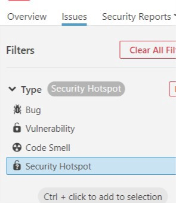
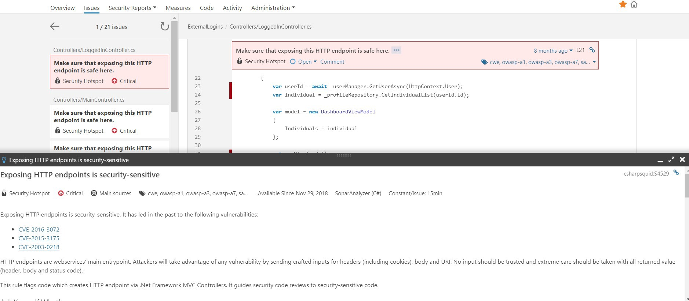
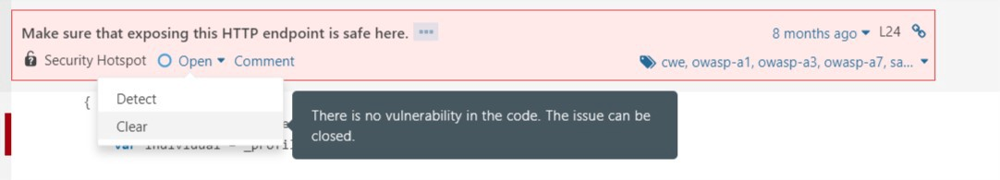

# Análise de segurança de uma aplicação .Net MVC usando SonarQube

### O que é SonarQube
É uma plataforma de código aberto para inspeção contínua da qualidade do código, para executar revisões automáticas com análise estática do código para detecção de bugs, "code smells" e vulnerabilidades de segurança.

## Pré-requisitos
* Ter uma conta no SonarCloud
* Ter o Java SE Runtiment Enviroment instalado
* SonarScanner for MS Build (no projeto a ser analisado)
  
_Obs.: o SonarScanner pode ser instalado usando o gerenciador de pacotes do .Net, o Nuget, ou pela linha de comando:
Exemplo:_

`dotnet tool install --global dotnet-sonarscanner --version 5.2.0`

## Passo-a-passo
### Adicionando o projeto no SonarCloud:
1 - Como o SonarCloud é uma ferramenta online, é necessário logar no [site](https://sonarcloud.io/), clicar no menu superior e selecionar a opção para adicionar um novo projeto:



_Obs.: Para adicionar um novo projeto é necessário ter uma "organização", ao adicionar podemos usar um repositório único do GitHub, mas será necessário igual criar uma organização no SonarCloud e pode ser usado o plano Free._

2 - Feito e configurado a observação acima, basta selecionar o projeto.

3 - Após clicar em _Set_ _Up_, uma tela para configurações será exibida. Basta gerar um novo token.

4 - Feito isso, basta executar os seguintes comandos no diretório raiz do projeto:

`MsBuild.exe /t:Rebuild`
`dotnet-sonarscanner end /d:sonar.login="<TOKEN_GERADO>"`

Agora o projeto já está configurado para ser analisado pelo SonarQube, para visualizar as informações como abaixo, basta clicar na aba My Projects no site SonarCloud  



E você verá um Overall do projeto, como por exemplo:


_Obs.: Se o projeto é criado no plano Free, ele automaticamente ficará em modo público (e não pode ser alterado, a nao ser que contrate algum outro plano) e qualquer um com o link do projeto poderá analisar como está a qualidade do seu código._

### Verificando os problemas:
Na página principal, selecionar o projeto que está sendo análisado. Você será redirecionado para uma nova página, procure e clique na aba **Issues**, feito isso, aplique o filtro do tipo Security Hotspot, deverá ficar mais ou menos assim:



Nessa página, temos os problemas encontrados na análise, mas é necessário verificar de uma forma bem crítica quais desses itens são de fato um problema e corrigi-los quando necesário.

Para fazermos isso, podemos clicar em um dos itens e analisar o contexto para determinar se o problema existe.

Um exemplo: clicando em um dos itens apontados e analisar o contexto do código para determinar se o problema existe:



Usando esse exemplo, analisando o código, percebe-se que para os _endpoints_ logados não estava sendo verificado se o usuário estava autenticado, resolvendo esses problemas na próxima análise o Sonar não irá apontá-los.

Para o problema informado (Make sure that exposing this HTTP endpoint is safe here), analisando o contexto de uso, não iremos mais ter problemas já que no paragráfo acima foi corrigido que todas as requisições serão autenticadas.

Para realizar novamente a análise do código, precisamos novamente executar os comandos no diretório raiz do projeto:

```
dotnet-scanner begin /k:”<PROJECT_KEY>” 
/d:sonar.organization=”<ORGANIZATION_KEY>” 
/d:sonar.host.url=”https://sonarcloud.io" 
/d:sonar.login=”<TOKEN_GERADO>"

MsBuild.exe /t:Rebuild

dotnet-sonarscanner end /d:sonar.login="<TOKEN_GERADO>"
```

Agora, com todas alterações feitas e com a garantia que as requisições feitas são tratadas corretamente, podemos considerar esse problema resolvido. Porém, como essa solução não foi feita de forma automática, precisamos voltar até o problema e identificá-lo como resolvido.



Feito isso, esse problema não será mais listado.

Nesse tutorial usamos como exemplo os Security Hotspots, porém a lógica usada aqui para resolver os problemas podem ser usadas para resolver os problemas do tipo "Vulnerability"
  

# Licença

[![CC BY-SA 4.0][cc-by-sa-shield]][cc-by-sa]

Esse trabalho está licenciado sob a licença
[Creative Commons Attribution-ShareAlike 4.0 International License][cc-by-sa].

[![CC BY-SA 4.0][cc-by-sa-image]][cc-by-sa]

[cc-by-sa]: http://creativecommons.org/licenses/by-sa/4.0/
[cc-by-sa-image]: https://licensebuttons.net/l/by-sa/4.0/88x31.png
[cc-by-sa-shield]: https://img.shields.io/badge/License-CC%20BY--SA%204.0-lightgrey.svg